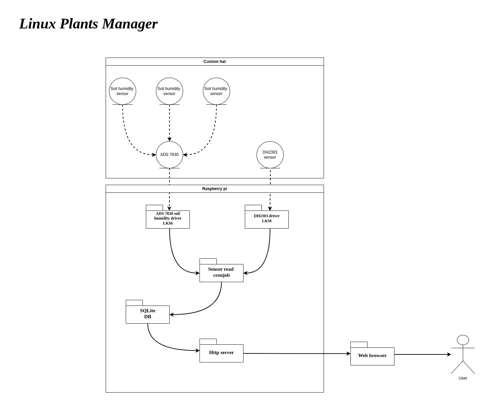

# linux_plants_manager

The project creates simple plants managment application on raspberry pi 5. Currently available features:
- Monitor soil humidity
<!-- - Monitor air temprature -->
<!-- - Monitor air humidity -->


Hardware required to build the app:
- https://botland.store/multifunctional-sensors/2637-temperature-and-humidity-sensor-dht22-am2302-module-cables-5904422372712.html
- https://learn.adafruit.com/adafruit-ads7830-8-channel-8-bit-adc
- https://botland.store/raspberry-pi-5-modules-and-kits/25346-raspberry-pi-5-2gb-5056561803302.html
- https://mikrobot.pl/czujnik-wilgotnosci-gleby-v1-2-pojemnosciowy
- https://botland.com.pl/zawory/9453-zawor-elektromagnetyczny-12v-002-08mpa-z-szybkozlaczem-5904422313388.html
- https://botland.com.pl/pompy/15387-elektryczna-pompa-perystaltyczna-6v-velleman-wpm447-5410329703073.html?utm_source=chatgpt.com
- https://botland.com.pl/przekazniki-przekazniki-arduino/2357-modul-przekaznikow-8-kanalow-z-optoizolacja-styki-10a250vac-cewka-5v-czerwony-5903351241373.html

And some tubing for irrigation, look on irrigation architecture document in docs/ to order proper elements, for yourself.

## Architecture drawing

TO-DO: update architecture drawing to include pump and valves.



## Install perequesites

To manage a project you need invoke python package. It can be installed on debian via
```
sudo apt install python3-invoke
```

## Build app

Build can be triggered with
```
inv build
```

Once build is done you should in `build` directory:
- sdcard.img

## Connect hardware

Connect ADS7830 to RPI 5:
- VIN pin to 3.3v power
- GND pin to GND
- SDA pin to GPIO 2
- SCL pin to GPIO 3

Image showing rpi pinnout can be found [here](https://pinout-ai.s3.eu-west-2.amazonaws.com/raspberry-pi-5-gpio-pinout-diagram.webp).

Image showing connecting rpi to ADS7830 can be found [here](https://cdn-learn.adafruit.com/assets/assets/000/125/868/original/adafruit_products_piBB_bb.jpg?1699283305).
